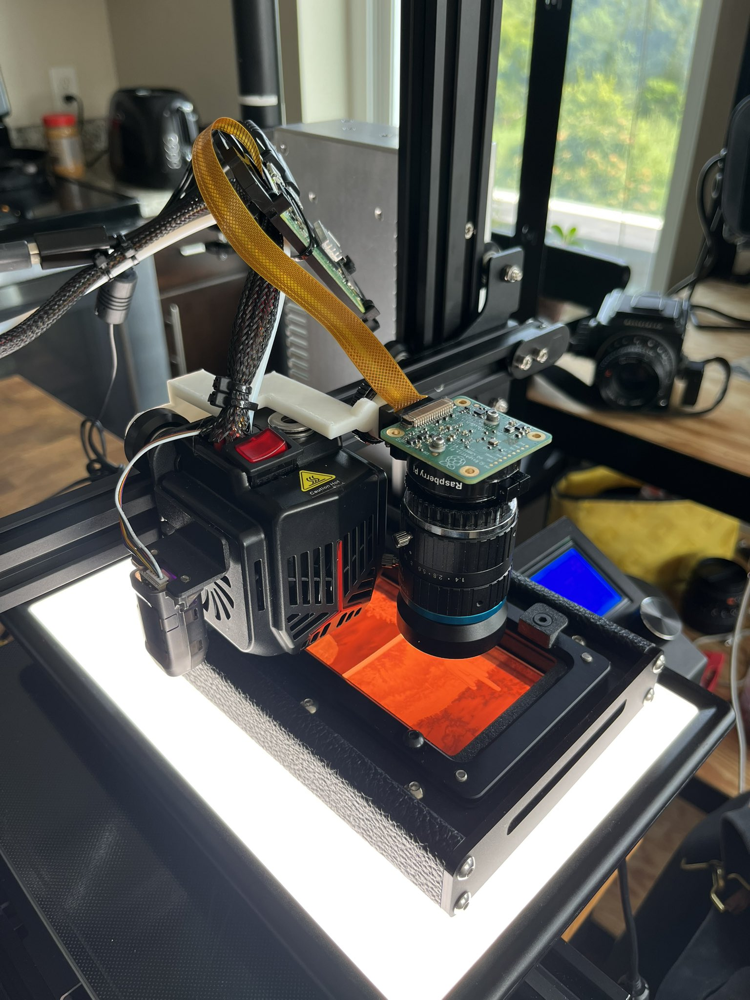

# Ender Scanner
### Tools for scanning film negatives with an Ender 3 Neo

An Ender 3 can be used as a film scanner:

 - Its generous print volume fits a light panel and a loaded film negative holder. 
 - A Raspberry Pi HD camera can be mounted face-down on the printhead and swept around to capture macro pictures of the film negative.
 - Those captures can be stitched.

## Why

> What is the motivation for doing this?

At the time of writing, most quality film scanning technology is some combination of proprietary, aging, thousands of dollars and awkward to use and set up. 
It is possible the 3D printer approach can be refined into a viable alternative.

My motivation: because you can. :)

## Components

In slightly more detail, the following pieces are involved (roughly in order of build and usage steps):
 
 - `ender3_picamera_v2.scad`: A bracket to mount the Raspberry Pi HD camera onto the print head with a couple M5 nuts and a camera screw like [this one](//www.amazon.com/dp/B0823HGR94). 
	- To reduce vibration, the Ender 3's printhead also needs to be modded with a switch to turn the front fan off. 
	Don't ever turn the fan off or leave the camera mounted during a print!
 - The Raspberry Pi HD camera I am using for development is the commonly available 16 mm C-mount lens, plus an extra 5 mm macro extension (in addition to the 5 mm "CS-to-C" extension that comes with the HD camera module). 
 - A Raspberry Pi Zero W operates the camera, and the Ender 3 printhead via OctoPrint. 
	A separate 'host computer' is going to operate the camera and Ender 3 through this Zero W:
	- The Zero W has SSH access with no-password pubkey authentication. The host uses this interface to capture images & download them.
	- OctoPrint has a web interface with a REST API key for the main OctoPrint user. The host uses this interface to control the print head.
 - A bunch of scripts to run on the host computer that perform scan functions:
	- `zup.py`: Draw the print head up to a "center" location + some Z displacement.
		After running this, roughly center the light panel + film negative underneath the camera. 
	- `zstack.py`: Capture a bunch of images of the film negative for a range of Z displacements, and download them to a folder on the host computer. 
		This is used to find the focus plane. 
	- `basic_scan.py`: Sweep the print head around to capture an X-Y grid of images, and download them to a folder on the host computer.
	- `stitch.py`: Attempts to stitch segments from `basic_scan.py` using panotools. 
		The strategy: (1) Get control points for each group of 2x2 in the grid. 
		(2) Make a new project file with all the control points, and find optimal positions.
		(3) Produce a stitched .TIF with a blend tool ([multiblend](https://horman.net/multiblend/) is much faster than Panotools' enblend)

## Possible future work

A lot more development and experimentation is needed to make this scan approach useful for "normal" users.
The high-level scan process facing the user and robustness of the steps involved both need improvement.
A few ideas are worth exploring:

 - Mounting bracket that facilitates adjusting the lens toward parallel film plane.
 - Auto-exposure and auto-focus-finding, possibly per-segment. 
	This could benefit highly warped negatives or a misaligned camera lens.
 - Stitch routine that fails gracefully: some batches of scan segments will be difficult to stitch. 
	The stitch routine should detect when it didn't find good control points a 2x2 sub-problem, then hand the user an interface to position that part of the image visually, by hand.
 - Achieve higher effective color bit-depth by capturing multiple exposures and high-precision averaging. 
 - Scan wizard 
 - GUI tool
 - Automatic film advancement mechanism 
 - Nicer lens and sensor...

